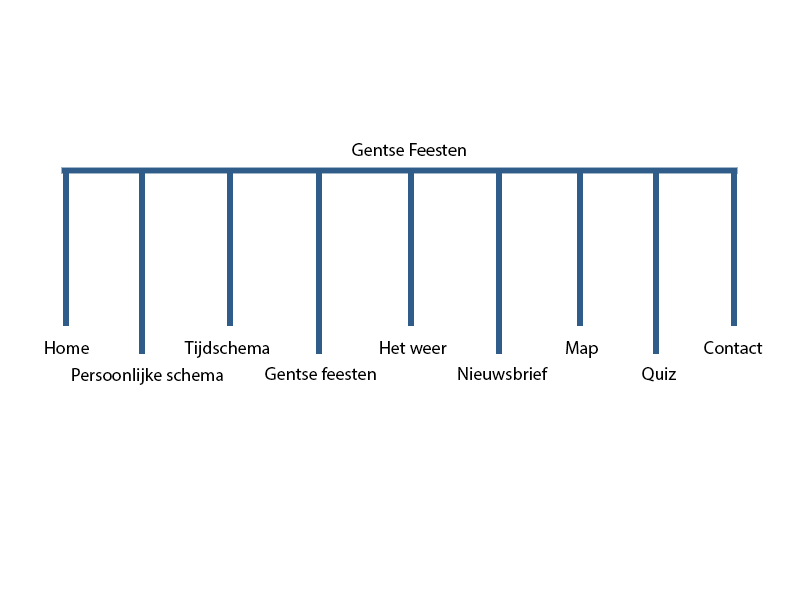
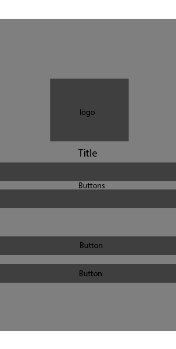
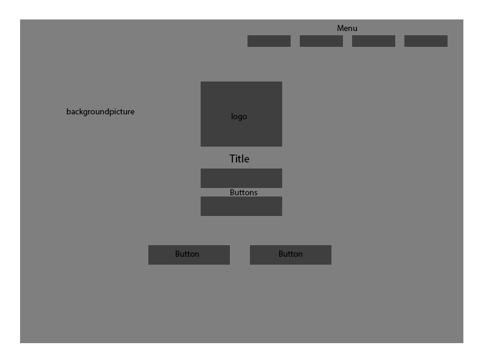
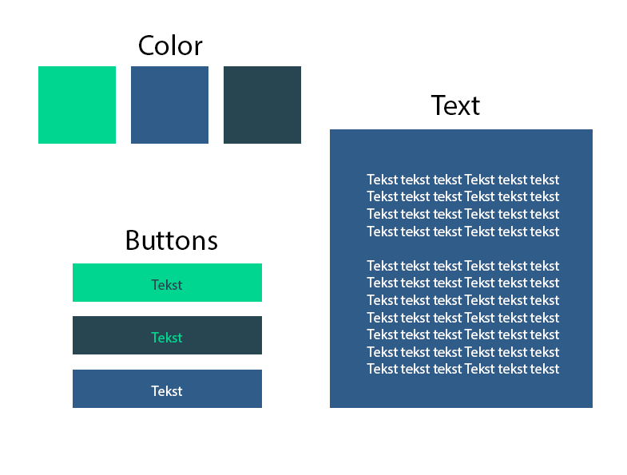
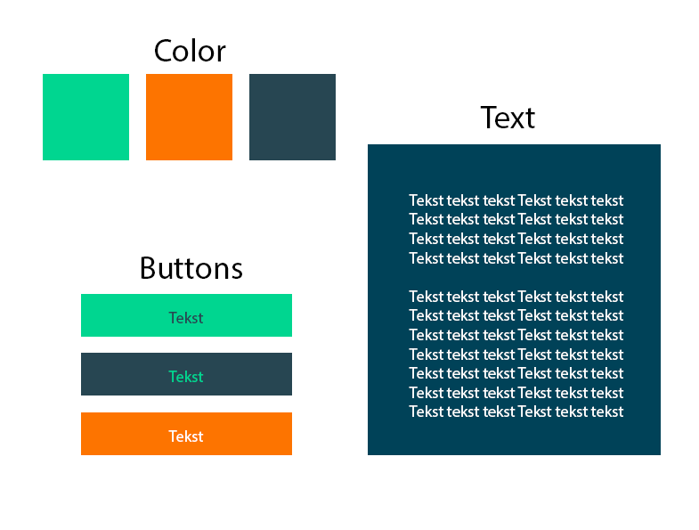
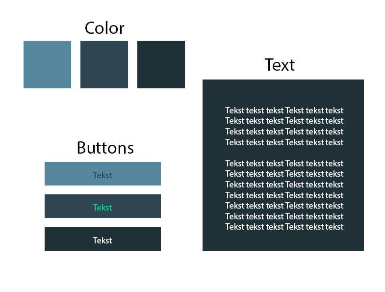

Gentse Feesten
==============

Briefing en analyse
-------------------

Gentse feesten is een idiaale webappp voor tijdens gentse feesten. Met deze app kun je:
-Quiz spelen ivp gentse feesten
-Eerst volgende event bekijken
-Favoriete event selecteren en bijhouden
-Weer komende uur zien
-Weer komenede dagen zien
-Je lokatie bekijken
-Events op het map zien
-Parkings op het map zien

Technische specificaties
------------------------

### Webtechnologieën

De app zal geschreven worden in HTML5, CSS3, en JavaScript. 

### Datasets

Volgende datasets zullen geïntegreerd worden in de app:
* [Alle events van de gentse feesten](http://datatank.stad.gent/4/toerisme/gentsefeestenevents.json)
* [Dagen van de gentse feesten](http://datatank.stad.gent/4/cultuursportvrijetijd/gentsefeestendata.json)
* [Weerverwachtingen komende uur](http://datatank.stad.gent/4/milieuennatuur/weersverwachting1u.json)
* [Weerverwachtingen komende dagen](http://api.openweathermap.org/data/2.5/forecast?id=2797656&appid=1b6a7c42b91c919a501bb8c7e8339634)
* [parkings](http://datatank.stad.gent/4/mobiliteit/bezettingparkingsrealtime.json)

### Inladen van de quizvragen

De quizvragen zullen ingeladen worden door middel van een zelfgeschreven JSON. 10 zelf opgestelde vragen.

Ideëenborden
------------

---

---

Sitemap
-------

Wireframes
----------

### Mobiel

### Desktop

Style tiles
-----------

---

---

